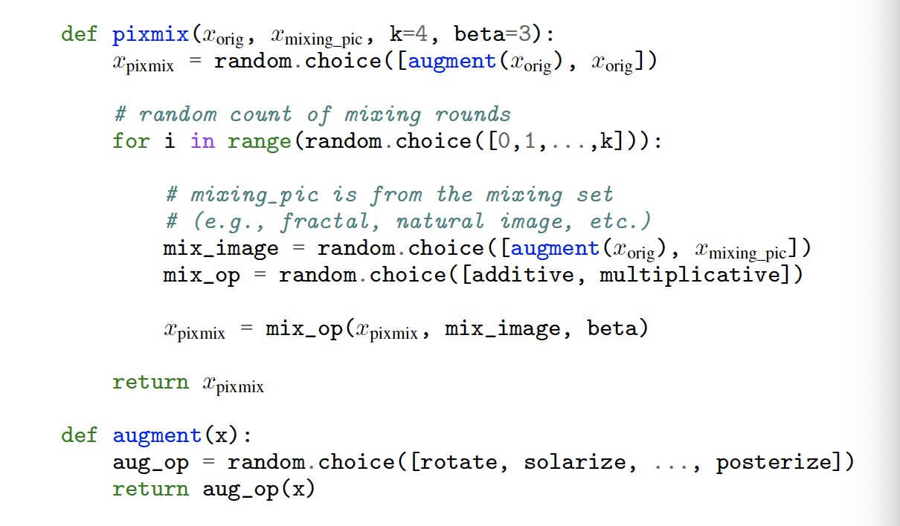

# PixMix

This is the repository for "[PixMix: Dreamlike Pictures Comprehensively Improve Safety Measures](https://arxiv.org/abs/2112.05135.pdf)"  
by [Dan Hendrycks*](https://danhendrycks.com/), [Andy Zou*](https://andyzoujm.github.io/), [Mantas Mazeika](https://www.linkedin.com/in/mmazeika/), [Leonard Tang](https://leonardtang.me/), [Bo Li](https://aisecure.github.io), [Dawn Song](https://people.eecs.berkeley.edu/~dawnsong/), and [Jacob Steinhardt](https://www.stat.berkeley.edu/~jsteinhardt/).


## Introduction

In real-world applications of machine learning, reliable and safe systems must consider
measures of performance beyond standard test set accuracy. These other goals
include out-of-distribution (OOD) robustness, prediction consistency, resilience to
adversaries, calibrated uncertainty estimates, and the ability to detect anomalous
inputs. However, improving performance towards these goals is often a balancing
act that today’s methods cannot achieve without sacrificing performance on other
safety axes, raising the question of whether a Pareto improvement on
all existing safety measures is possible. To meet this challenge, we design a new
data augmentation strategy utilizing the natural structural complexity of pictures
such as fractals, which outperforms numerous baselines, is near Pareto-optimal,
and comprehensively improves safety measures.

## Pseudocode



## Contents

`pixmix_utils.py` includes reference implementation of augmentations and mixings used in PixMix.

We also include PyTorch implementations of PixMix on both CIFAR-10/100 and
ImageNet in `cifar.py` and `imagenet.py` respectively, which both support
training and evaluation on CIFAR-10/100-C and ImageNet-C/R.

## Usage

Training recipes used in our paper:

CIFAR: 
  ```
  python cifar.py \
    --dataset <cifar10 or cifar100> \
    --data-path <path/to/cifar and cifar-c> \
    --mixing-set <path/to/mixing_set> \
    --all-ops
  ```

ImageNet 1K:
  ```
  python imagenet.py \
    --data-standard <path/to/imagenet_train> \
    --data-val <path/to/imagenet_val> \
    --imagenet-r-dir <path/to/imagenet_r> \
    --imagenet-c-dir <path/to/imagenet_c> \
    --mixing-set <path/to/mixing_set> \
    --num-classes 1000 \
    --all-ops
  ```

## Mixing Set

The mixing set of fractals and feature visualizations used in the paper can be downloaded
[here](https://drive.google.com/file/d/1qC2gIUx9ARU7zhgI4IwGD3YcFhm8J4cA/view?usp=sharing).

## Pretrained Models
Weights for a 40x4-WRN CIFAR-10/100 classifier trained with PixMix for 100 epochs are available
[here](https://drive.google.com/drive/folders/1tHu2MBU3P9lvgtc06_VaC6AsMqwyYFSA?usp=sharing).

Weights for a ResNet-50 ImageNet classifier trained with PixMix for 90 and 180 epochs are available
[here](https://drive.google.com/drive/folders/1tHu2MBU3P9lvgtc06_VaC6AsMqwyYFSA?usp=sharing).

## Citation

If you find this useful in your research, please consider citing:

    @article{hendrycks2022robustness,
      title={PixMix: Dreamlike Pictures Comprehensively Improve Safety Measures},
      author={Dan Hendrycks and Andy Zou and Mantas Mazeika and Leonard Tang and Bo Li and Dawn Song and Jacob Steinhardt},
      journal={CVPR},
      year={2022}
    }
